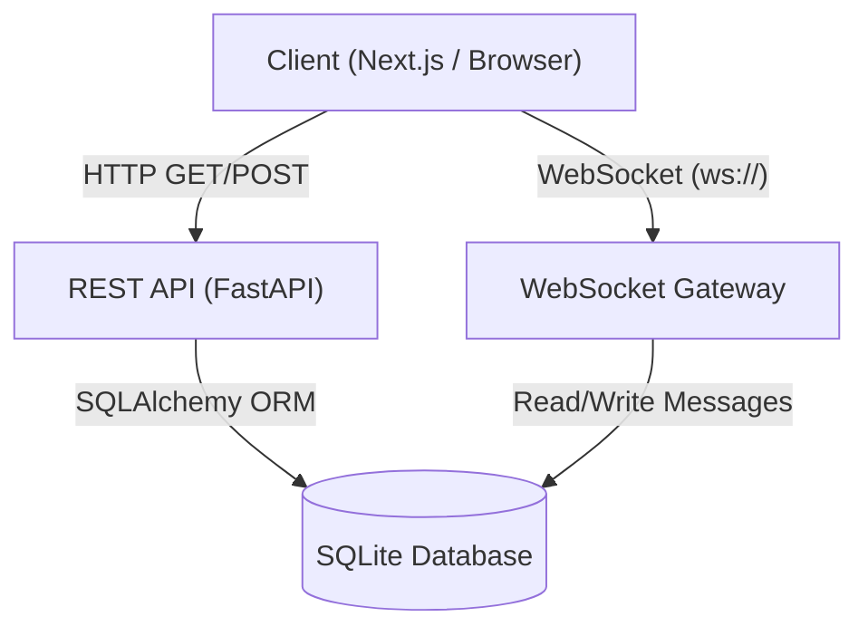
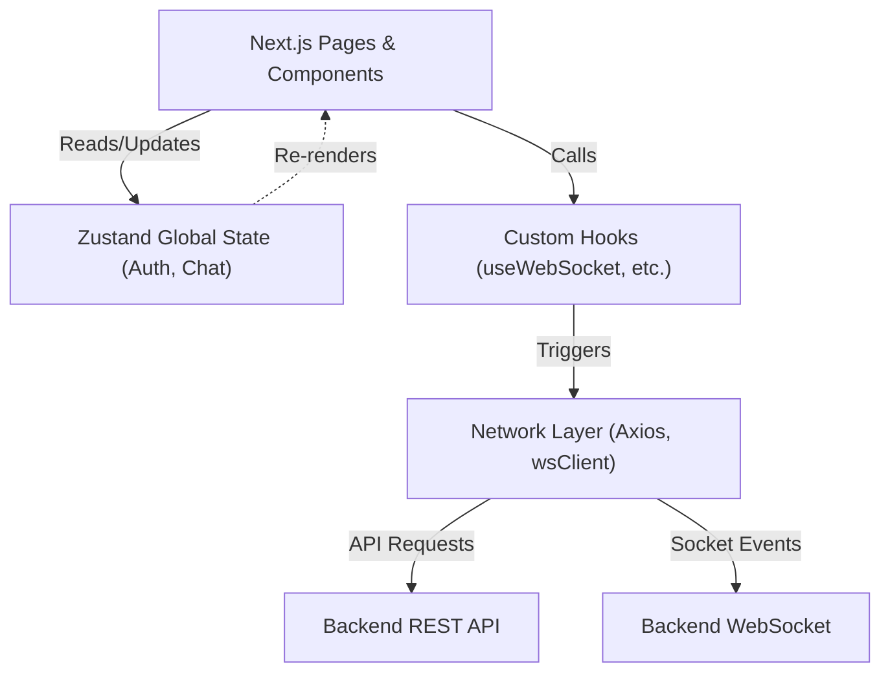
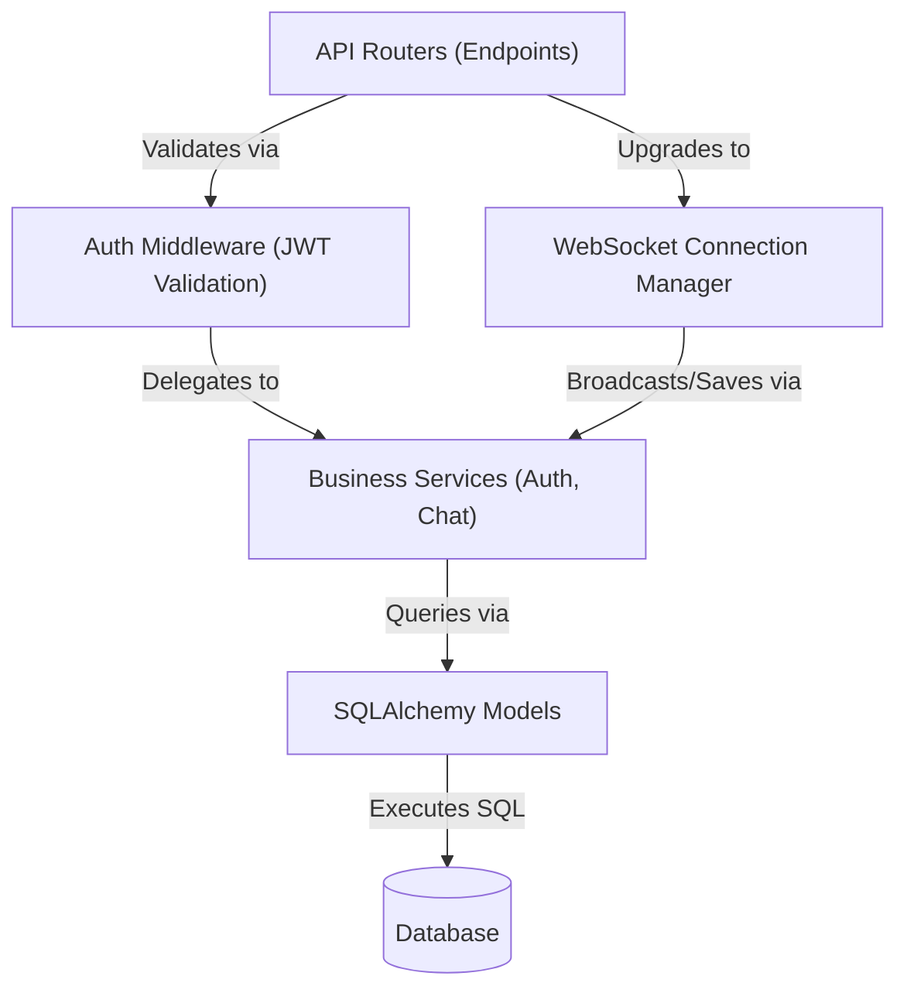
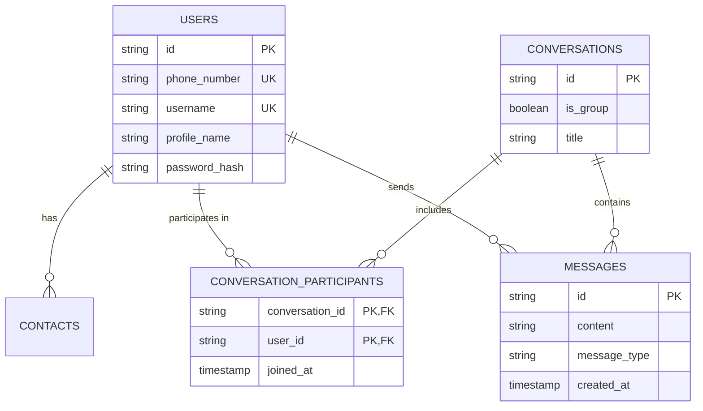

# SecureChat (Signal Clone)

[PLACEHOLDER: Insert Demo Video Link Here]

## Project Overview

SecureChat is a full-stack, real-time messaging application engineered to replicate the core functionality, user interface, and user experience of the Signal Desktop application. It provides end-to-end real-time communication capabilities, including individual and group messaging, typing indicators, and user discovery. The system is designed with a strict focus on performance, robust state management, and an exact pixel-perfect UI parity with modern chat applications.

## Architecture Overview

The application utilizes a modern, decoupled client-server architecture.

### Frontend
- Framework: Next.js (React) with App Router.
- Styling: Tailwind CSS configured for a precise dark-mode design system.
- State Management: Zustand is used for scalable, boilerplate-free global state management (managing authentication sessions, chat histories, and UI toggles).
- Real-time Communication: Native browser WebSocket API integrated with a custom client-side reconnection and event-handling wrapper.
- HTTP Client: Axios with request interceptors for automated JWT token injection.

### Backend
- Framework: FastAPI (Python), providing high-performance, asynchronous REST API endpoints.
- Database ORM: SQLAlchemy mapped to a SQLite relational database.
- Authentication: JWT (JSON Web Tokens) with BCrypt password hashing.
- Real-time Server: FastAPI WebSocket endpoints integrated with an in-memory connection manager that broadcasts messages and typing events to active clients.

### Communication Flow
1. Standard HTTP requests are utilized for stateless operations: authentication, retrieving historical message data, and searching for users.
2. An upgraded TCP WebSocket connection is established upon successful authentication. This persistent tunnel facilitates bi-directional, low-latency streaming of messages and transient events (e.g., typing indicators).

### Architecture Diagrams

#### 1. High-Level System Architecture

#### 2. Frontend Architecture

#### 3. Backend Architecture

## Database Schema

The relational database is normalized and structured to handle complex many-to-many relationships inherent in chat applications.

### 1. Users Table
Stores core identity and authentication credentials.
- id (Primary Key, UUID)
- phone_number (String, Unique, Indexed)
- username (String, Unique)
- profile_name (String)
- password_hash (String)
- created_at (Timestamp)

### 2. Contacts Table
Self-referencing many-to-many relationship mapping users to their saved contacts.
- id (Primary Key, UUID)
- user_id (Foreign Key -> Users.id)
- contact_id (Foreign Key -> Users.id)
- created_at (Timestamp)

### 3. Conversations Table
Represents a messaging thread. Can be an individual direct message or a multi-user group chat.
- id (Primary Key, UUID)
- is_group (Boolean)
- title (String, Nullable - used for groups)
- created_at (Timestamp)

### 4. ConversationParticipants Table
Junction table linking users to the conversations they are a part of.
- conversation_id (Foreign Key -> Conversations.id)
- user_id (Foreign Key -> Users.id)
- joined_at (Timestamp)
- Primary Key (conversation_id, user_id)

### 5. Messages Table
Stores the payload of the communication.
- id (Primary Key, UUID)
- conversation_id (Foreign Key -> Conversations.id)
- sender_id (Foreign Key -> Users.id)
- content (Text)
- message_type (String - e.g., 'text', 'image')
- created_at (Timestamp)

### Database ER Diagram

## API Overview

The backend exposes a versioned RESTful API (`/api/v1`) alongside a WebSocket gateway. All routes except authentication require a valid JWT Bearer token in the Authorization header.

### Authentication Endpoints
- POST `/api/v1/auth/register`: Accepts user details (phone, username, password) and creates a new user record. Returns a JWT access token.
- POST `/api/v1/auth/login`: Authenticates credentials and issues a JWT access token.

### User Endpoints
- GET `/api/v1/users/me`: Retrieves the profile of the currently authenticated user.
- GET `/api/v1/users/search?q={query}`: Searches the database for users matching the query by phone number or username.

### Conversation Endpoints
- GET `/api/v1/conversations`: Returns a list of all conversations the authenticated user is participating in, ordered by recent activity.
- POST `/api/v1/conversations`: Initializes a new conversation with a target user or group of users.

### Message Endpoints
- GET `/api/v1/messages/{conversation_id}`: Retrieves the paginated message history for a specific conversation.
- POST `/api/v1/messages/{conversation_id}`: Persists a new message to the database and triggers a WebSocket broadcast to the relevant participants.

### WebSocket Gateway
- `ws://{host}/ws/{token}`: Upgrades the connection. The server expects JSON payloads specifying an `event` type (e.g., `typing_start`, `typing_stop`) and routes them to the connected clients in the specified `conversation_id`.

## Setup Instructions

Follow these steps to configure and run the application locally.

### Prerequisites
- Python 3.10 or higher
- Node.js 18 or higher
- npm (Node Package Manager)

### Backend Setup
1. Open a terminal and navigate to the backend directory:
   cd backend
2. Create and activate a Python virtual environment:
   python3 -m venv venv
   source venv/bin/activate
3. Install the required dependencies:
   pip install -r requirements.txt
4. Configure the environment variables by duplicating the example file:
   cp .env.example .env
   (Ensure the JWT_SECRET is set inside the .env file)
5. Start the FastAPI development server:
   uvicorn app.main:app --reload
   The API will be accessible at http://localhost:8000.

### Frontend Setup
1. Open a new terminal instance and navigate to the frontend directory:
   cd frontend
2. Install the required Node dependencies:
   npm install
3. Configure the environment variables:
   cp .env.example .env.local
   (Ensure NEXT_PUBLIC_API_URL is set to http://localhost:8000/api/v1 and NEXT_PUBLIC_WS_URL is set to ws://localhost:8000/ws)
4. Start the Next.js development server:
   npm run dev
   The web application will be accessible at http://localhost:3000.
